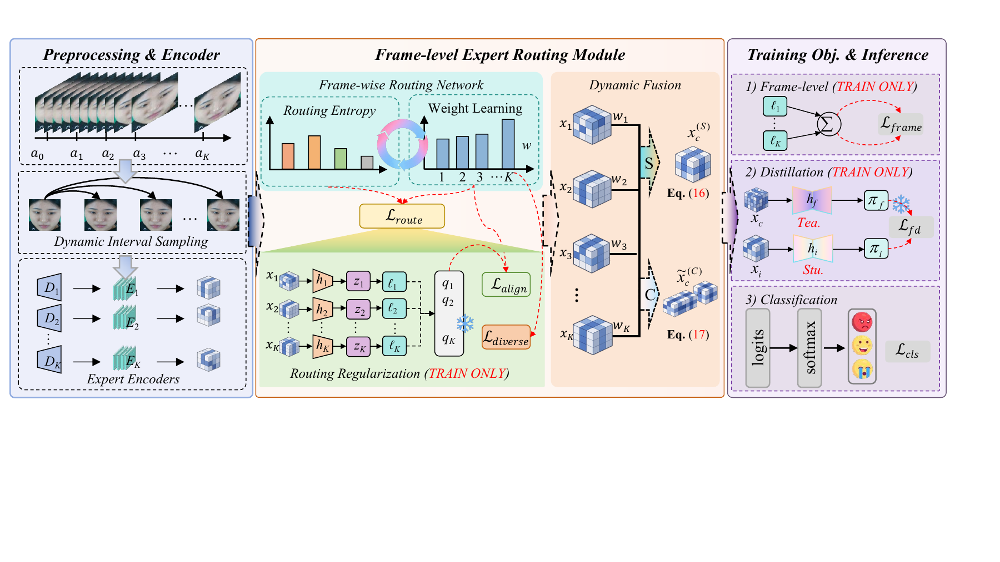

# DisMoE-S

### Temporal Expert Routing and Distillation for Apex-Free Micro-Expression Recognition

  
  
  

---

## Overview

Micro-expression recognition aims to identify genuine emotions from facial movements that are subtle, localized, and short-lived. A major challenge is that many existing methods depend on apex-frame annotations or fixed temporal priors, which limits their use in apex-free settings.

**DisMoE** is a temporal expert routing and distillation framework for apex-free micro-expression recognition. It uses the onset frame as a reference, samples multiple observations within the onset–offset interval, and assigns each temporal slot to an independently parameterized expert. A sample-adaptive routing network then learns how much each expert should contribute to the final prediction.

The framework combines:

- **Dynamic Interval Sampling (DIS)** to construct onset-referenced, apex-free motion observations;
- **Continuous Attention (CA)** to progressively refine expression-relevant facial representations;
- **Frame-level Expert Routing Module (FERM)** with a Frame-wise Routing Network (FRN) for adaptive temporal fusion;
- **Frame-level Distillation (FD)** to transfer complementary knowledge from the fused prediction back to individual experts.

## Model Architecture

  

<em>Overall architecture of DisMoE. The routing regularizers and frame-level distillation are used during training, while the fused branch is retained for inference.</em>

### How it works

1. **Onset-referenced motion construction.** DIS samples multiple non-reference observations from the onset–offset interval and forms frame differences with respect to the onset frame. No apex annotation is required.
2. **Slot-specific temporal experts.** Each motion observation is processed by its own expert, allowing different temporal slots to learn complementary motion patterns.
3. **Adaptive expert routing.** FRN predicts a normalized weight for every expert. FERM performs dense, sample-adaptive fusion instead of sparsely selecting interchangeable experts.
4. **Training-time regularization and distillation.** Reliability alignment and diversity regularization stabilize routing, while FD transfers the fused branch's complementary temporal knowledge to individual experts.

## DisMoE Variants

- **DisMoE-S** uses weighted summation for a compact fused representation and a favorable accuracy–efficiency trade-off.
- **DisMoE-C** uses weighted concatenation followed by projection to preserve more slot-specific temporal information.

Both variants share the same apex-free temporal expert routing and frame-level distillation framework.
